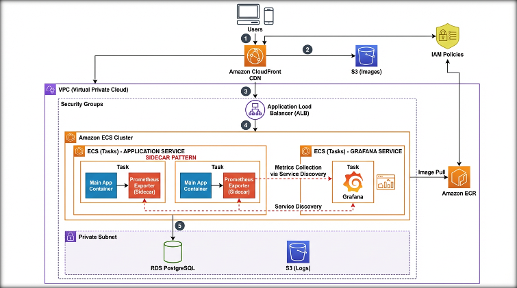
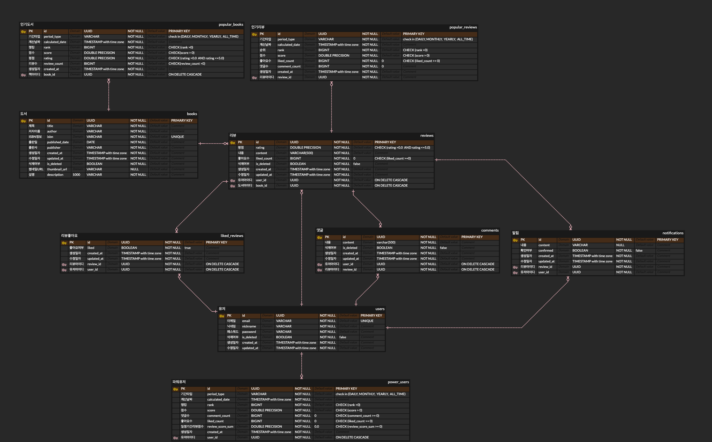

## 덕후감 테스트커버리지
[](https://codecov.io/gh/sb7-deokhugam-team2/sb07-deokhugam-team2)
# 📚 덕후감 (Deokhugam)
> **책 덕후들의 감상 플랫폼** - 읽은 책을 기록하고 공유하며 소통하는 커뮤니티

<br>

## 프로젝트 소개
**"독서를 혼자만의 취미가 아닌, 함께 나누는 즐거움으로"**

덕후감은 사용자가 읽은 책을 검색하고, OCR(광학 문자 인식) 기능을 통해 책 정보를 손쉽게 불러와 리뷰를 작성할 수 있는 도서 커뮤니티 플랫폼입니다. 단순한 기록을 넘어 좋아요, 댓글, 파워 유저 랭킹 시스템을 통해 독서가들 간의 활발한 소통을 지향합니다.

* **프로젝트 기간**: 2026.01.05 ~ 2026.01.26 (스프린트 SB07기 Part3)
* **배포 링크**: [https://d13piuebfxvrtf.cloudfront.net](https://d13piuebfxvrtf.cloudfront.net)
* **팀 노션/협업 문서**: https://plume-second-3a7.notion.site/2df60c0f562780d0a50fde1dfd2e8d33

<br>

## 팀원 구성
**스프린트 SB07기 Part3 2팀**

| **이형일 (PM)** | **김유미** | **김태언** | **안대식** | **조성연** | **최현석** |
| :---: | :---: | :---: | :---: | :---: | :---: |

<br>

## 기술 스택 (Tech Stack)

### Backend
* **Core**: Java 17, Spring Boot 3.x
* **Database**: PostgreSQL 8.0 (Prod), H2 (Test)
* **ORM**: Spring Data JPA, QueryDSL
* **Batch**: Spring Batch

### Infrastructure & DevOps
* **Cloud**: AWS (EC2, S3, CloudFront, ECR, RDS)
* **Container**: Docker, Docker Compose
* **CI/CD**: GitHub Actions
* **Monitoring**: Prometheus, Grafana

### Tools & API
* **Collaboration**: Git, GitHub, Discord, Notion
* **External API**: Naver Books API (도서 검색), OCR API (ISBN 추출)

<br>

## 팀원별 구현 기능 상세

### 👤 [안대식, 김유미] : 사용자(User) 관리
* **회원 정보 관리**
    * 프로필 조회, 수정, 비밀번호 변경 구현
    * 회원 탈퇴 시 `BaseDeletableEntity`를 활용한 Soft Delete 처리
    * 회원가입 및 로그인

### 📚 [김태언, 조성연] : 도서(Book) 관리
* **도서 검색 및 조회 API**
    * Naver Book API를 연동하여 실시간 도서 검색 기능 구현
    * 검색 성능 최적화를 위한 QueryDSL 기반의 동적 필터링 및 정렬 구현

* **OCR 기반 도서 정보 추출**
    * 사용자가 업로드한 책 뒷면(바코드) 이미지를 분석하여 ISBN을 추출하는 `IsbnExtractor` 구현
    * 외부 OCR API 통신 시 예외 처리 및 재시도 로직 적용

### ✍️ [이형일, 최현석] : 리뷰(Review) 관리
* **리뷰 CRUD 및 이미지 처리**
    * AWS S3를 연동한 다중 이미지 업로드 및 관리
    * 리뷰 작성 시 도서 정보 자동 매핑 로직 구현
    * QueryDSL을 사용한 리뷰 페이징 및 정렬 처리
* **리뷰 좋아요 시스템**
    * 리뷰 좋아요 토글 기능 및 중복 방지 로직 구현
    * 동시성 이슈를 고려한 좋아요 카운트 업데이트

### 💬 [안대식, 김유미] : 댓글(Comment) 관리
* **계층형 댓글 시스템**
    * 리뷰에 대한 댓글 및 대댓글 작성 기능 구현
    * QueryDSL을 사용하여 댓글 페이징 및 정렬 처리
* **리뷰 좋아요 시스템**
  * 리뷰 좋아요 토글 기능 및 중복 방지 로직 구현
  * 동시성 이슈를 고려한 좋아요 카운트 업데이트

### 🏆 [이형일, 김태언, 안대식] : 랭킹(Ranking) & 배치(Batch)
* **파워 유저 선정 시스템**
    * Spring Batch Job을 구성하여 활동량(리뷰 수, 좋아요 수 등) 기반 유저 랭킹 산정
    * `Scheduler`를 통한 배치 작업 자동화 및 모니터링
* **인기 리뷰 선정**
    * 기간별 조회수와 좋아요 수를 종합하여 인기 리뷰를 선정하는 알고리즘 구현
    * `Scheduler`를 통한 배치 작업 자동화 및 모니터링
* **인기 도서 집계**
    * Spring Batch를 활용하여 특정 기간 동안 리뷰가 가장 많이 달린 도서
    * `Scheduler`를 통한 배치 작업 자동화 및 모니터링

### 🔔 [김유미, 안대식] : 알림(Notification) 관리
* **알림 자동 삭제**
    * Spring Batch Job을 구성하여 자동 알림 삭제
    * `Scheduler`를 통한 배치 작업 자동화 및 모니터링 (`JobMetricsListener`)
* **알림 시스템**
    * 내 리뷰에 댓글이나 좋아요가 달렸을 때 알림 생성 로직 구현 (`NotificationCreator`)
    * 읽지 않은 알림 조회 및 읽음 처리 API
    * QueryDSL을 사용하여 댓글 페이징 및 정렬 처리

### 🔔 [이형일, 김태언, 조성연] : 모니터링 & 배포(Deployment)
* **시스템 모니터링 구축**
    * Prometheus와 Grafana를 Docker Compose로 구축하여 서버 리소스 및 API 요청 현황 시각화
* **CI/CD 및 인프라 구축**
    * GitHub Actions를 활용한 자동화된 빌드 및 배포 파이프라인(CI/CD) 구성
    * Docker 기반의 컨테이너 환경 구성 및 AWS 클라우드 배포

<br>

## 프로젝트 파일 구조
```bash
src/main/java/com/deokhugam
├── domain            # 도메인별 비즈니스 로직 (DDD 구조)
│   ├── user          # 사용자
│   ├── book          # 도서 정보, 외부 API 연동
│   ├── review        # 리뷰
│   ├── comment       # 댓글
│   ├── notification  # 알림 (Batch)
│   ├── popularbook   # 인기 도서 (Batch)
│   ├── poweruser     # 파워 유저 (Batch)
│   ├── popularreview # 인기 리뷰 (Batch)
│   └── likedreview   # 좋아요
├── global            # 전역 설정
│   ├── config        # Batch, Web, Storage 등 설정
│   ├── exception     # Global Exception Handler
│   └── interceptor   # 공통 유틸리티
└── infrastructure    # 인프라 계층
    ├── ocr           # OCR API 클라이언트
    ├── storage       # AWS S3 파일 업로드
    └── search        # 검색 API 연동
```
## 아키텍처


## ERD


## 트러블 슈팅 및 회고 (Troubleshooting & Retrospective)

### ⚠️ 트러블 슈팅 (Troubleshooting)
> 프로젝트 진행 중 발생한 주요 이슈와 해결 과정을 기록했습니다.

#### 1. AI 의존도와 학습의 균형
* **문제 상황**: 초기 개발 단계에서 생성형 AI 도구에 의존하다 보니, 작성된 코드의 동작 원리를 깊이 이해하지 못하고 넘어가는 경우가 발생했습니다.
* **해결 방안**:
    * **코드 리뷰 강화**: 데일리 스크럼 시간에 자신이 작성한 코드의 로직을 팀원들에게 설명하는 시간을 가졌습니다.
    * **재구현 원칙**: 스스로 설명할 수 없는 코드는 AI의 도움 없이 다시 공부하여 재구현하는 것을 원칙으로 세웠습니다.

#### 2. 도메인 간 복잡한 의존성 관리
* **문제 상황**: 리뷰, 도서, 사용자 등 각 도메인 간의 참조가 얽히면서 순환 참조 및 유지보수의 어려움이 예상되었습니다.
* **해결 방안**:
    * `Infrastructure` 계층과 `Domain` 계층을 명확히 분리하여 의존성 방향을 단방향으로 유지하려 노력했습니다.
    * 필요한 경우 `Service` 간의 직접 호출을 줄이고, 상위 계층(Facade)이나 이벤트를 통해 결합도를 낮추는 방안을 모색했습니다.

<br>

### 📝 프로젝트 회고 (Retrospective)

#### ✅ Keep (잘한 점)
* **AI 의존도 탈피 및 주도적 학습**: 단순히 기능을 구현하는 것에 그치지 않고, 모르는 부분은 공부하여 내 것으로 만든 뒤 일정에 지장이 없도록 진행했습니다.
* **원활한 의사소통과 협업**:
    * 매일 데일리 스크럼을 통해 각자의 진행 상황, 계획, 이슈를 투명하게 공유했습니다.
    * 서로 모르는 부분이 생기면 빠르게 공유하고 함께 문제를 해결하여, 팀 전체의 개발 속도를 높일 수 있었습니다.
* **효율적인 역할 분배**: 6개의 대형 요구사항을 기능별로 세분화하여 적절히 분배하였고, 이를 통해 모든 팀원이 각자의 몫을 묵묵히 수행해냈습니다.

#### ❌ Problem (아쉬운 점)
* **기술적 도전의 깊이**: 프로젝트의 안정적인 완성을 우선시하다 보니, 개인적으로 더 어렵거나 낯선 기술적 난제(Deep Dive)에 과감하게 도전해보지 못한 점이 아쉬움으로 남습니다.
* **초기 설계의 중요성**: 개발 중간에 구조를 변경하는 일이 있었는데, 초기 설계 단계에서 더 깊이 고민했다면 리소스를 아낄 수 있었을 것이라는 배움을 얻었습니다.

<br>

## 발표 자료 및 링크
프로젝트 최종 발표에 사용된 자료입니다.

* 🔗 **서비스 링크**: [https://d13piuebfxvrtf.cloudfront.net](https://d13piuebfxvrtf.cloudfront.net)